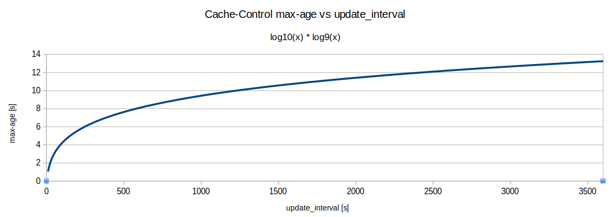

# Cache Settings

> `Status: Accepted`

> `Date: 2023-02-27`

> `Participants: Brice Schaffner, Christoph Böcklin, Jürgen Hansmann`

> `Updated: 2023-03-02 added proposal #2` 

## Context

`service-stac` uses currently a static cache settings for all requests:

- API requests: 600s / 10min (configured per staging)
- Assets download: 7200s / 2h (configured per staging)

The assets download cache setting is set when uploading the asset on S3.

For coming new functionality we need to have different cache settings depending at least on the collection,
even maybe on more fine grained selection (items/assets).

For the diemo service which now uses STAC and updates its assets every minutes, see below, we need to change
the asset download cache setting ASAP (before March 2023).

### Up coming scenarios

1. Realtime assets, changed every minutes or less (e.g. Diemo)
2. Very frequent changes, changed every 10 minutes or even less (Meteoschweiz)
3. Frequent asset updates, (e.g. every hours, twice a day, daily, bi weekly, weekly)
   1. After the update the new asset should be immediately available (e.g daily update at 12:00pm)
   2. After update we can afford to wait for the cached data expiration (e.g daily updates at midnight).
4. Infrequent updates: here it can be either a define low frequency (e.g. every 2 months, or every year) or sporadic update.
   1. After the update the new asset should be immediately available
   2. After update we can afford to wait for the cached data expiration.
5. Never

In theory scenario 5. doesn't exists as potentially every assets might be somewhen updated. Currently we support
scenario 4. and 5.

### Important facts

- S3 cache settings (`Cache-Control` header) cannot be changed once set, unless the object is uploaded again. Possibility to copy in place.
- S3 implements pre-conditional requests
- HTTP `Expires` header is discouraged to be used by AWS: [We recommend that you use the Cache-Control max-age directive instead of the Expires header field to control object caching. If you specify values both for Cache-Control max-age and for Expires, CloudFront uses only the value of Cache-Control max-age](https://docs.aws.amazon.com/AmazonCloudFront/latest/DeveloperGuide/Expiration.html#expiration-individual-objects)
- HTTP `Expires` header is ignored by most if not all implementation if `Cache-Control` with `max-age` or `s-maxage` is present
- No STAC API specifications for caching management
- STAC v1.0 `updated` `created` field:

    ```text
    created and updated have different meaning depending on where they are used. If those fields are available in the Item properties, they identify the creation and update times of the metadata. Having those fields in the Item assets refers to the creation and update times of the actual data linked to in the Asset Object.
    ```

    See [STAC Specs](https://github.com/radiantearth/stac-spec/blob/master/item-spec/common-metadata.md#stac-common-metadata)
    :warning: currently in our implementation, those fields always refer to the metadata data not the data !
    In STAC spec there is no `created` `updated` fields on collection level.
    In our implementation collection and item `updated` field is automatically updated when the child metadata are updated (item or asset) !  An asset upload automatically update the `checksum:multihash` and therefore update the `updated` field of the collection, item and asset !
- STAC Specification extension: [Timestamps Extension Specification](https://github.com/stac-extensions/timestamps)
  | Field  | Type   | Description   |
  |-------------- | -------------- | -------------- |
  | published    | string     | Date and time the corresponding data (see below) was published the first time, in UTC. |
  | expires | string | Date and time the corresponding data (see below) expires (is not valid any longer), in UTC. |
  | unpublished | string | Date and time the corresponding data (see below) was unpublished, in UTC. |
- Currently an asset update (new upload) automatically updates the asset metadata fields; `checksum:multihash` and `update`
  - To be checked if the asset update did not changed (same `checksum:multihash`) not sure if the `update` field is also updated, it depends on django framework and/or DRF framework, our code doesn't do any check and write the DB with the same data, the `update` field is automatically updated by django.
- Cloudfront cache invalidation takes time (> 20s) and it is independent of the path to invalidate. Every cache invalidation cost.
- Cloudfront `no-cache` => means low cache `~1s`
  
## Proposal #1

A proposal is to add a new field in the transactional API on the create asset; `update_interval`

This field would be of type INT and in seconds. In a first step it would be only part of the transactional API (not in the read endpoints) and be saved together with the asset in the DB. The visualization of this field is left for a next step,
where we might use an existing STAC extension like [Timestamps Extension Specification](https://github.com/stac-extensions/timestamps) or create a new extension, TBD.

Here below an example of JSON body in the asset create request `POST http://data.geo.admin.ch/api/stac/v0.9/collections/{collectionId}/items/{featureId}/assets/{assetId}/uploads`

```json
{
  "title": "Thumbnail",
  "description": "string",
  "type": "image/tiff; application=geotiff",
  "proj:epsg": 2056,
  "eo:gsd": 2.5,
  "id": "smr50-263-2016-2056-kgrs-2.5.tiff",
  "update_interval": 60
}
```

The value of this field could be checked via the admin interface only (read only field).
This field is saved in the `AssetUpload` model and copied over in the `Asset` model on the asset upload complete action, similar to the `checksum:multihash` field.

:warning: This field act on the cache settings of the asset data and API asset endpoint ! An asset upload automatically
updates the asset metadata with the new `checksum:multihash`.

`update_interval` `0` means instantly (changes happens infrequently from 1 seconds to several hours, days, week, ...). Setting `update_interval` to `-1` would mean `never` use case 4. and 5. above. So the default value of this field would be `-1` and then the default cache settings would be applied.

For any other value we would compute the cache settings for the asset data as follow:

- `< 60` => disable cache
- `>= 60` => sets `Cache-Control: public, max-age` to 1% of the rate with max to 2h (1% of a 8.3 day rate).
  - `60s` rate => `1s` cache
  - `10m` rate => `6s` cache
  - `1h` rate => `36s` cache => might be an issue for use case `3.1`
  - `12h` rate => `~7min` cache => might be an issue for use case `3.1`
  - `24h` rate => `~14min` cache => might be an issue for use case `3.1`
  - `48h` rate => `~28m` cache => might be an issue for use case `3.1`
  - `1w` rate => `~1.7h` cache => might be an issue for use case `3.1`

Based on the values above we can say that this solution would cover use case `1.`, `2.` and `3.2`. For use case `3.1` we would need another mechanism.

1. Using a smaller max cache settings, e.g. `10s`
2. Using the `Expires` HTTP header, also it is not recommended by AWS CF. We could use `Expires` only for the data and `max-age` for the API metadata with a low value.

> Chris: recommend to use the same mechanism with `Cache-Control` instead of `Expires` for use case 3.1. A first idea would be to have a service to deliver S3 data that can sets Cache-Control dynamically.

### Cache invalidation for use case 4.1

For this case we have no other solution than doing a manual cache invalidation on Cloudfront. To start I propose to do this
manually via AWS CLI or AWS console. Depending on the future if this use case comes very often we should provide an API endpoint that do the cache invalidation based on the collection and/or item path.

### Possible next step

As next step, would be to provide any read infos about this `update_interval`. One possible solution would be to 
use the [Timestamps Extension Specification](https://github.com/stac-extensions/timestamps) where the `expires` asset
field would be set based on the update time + `update_interval`. This field would be updated each time an asset upload is
either started or completed (TBD). If using this extension we need to keep in mind the collection/item/asset publication flag see [BGDIINF_SB-2676](https://jira.swisstopo.ch/browse/BGDIINF_SB-2676).

## Proposal #2 (updated on 2023-03-02)

During implementation the proposal #1 with two different linear approach, using a 10% for update_interval below 60s and 1% above shows an issue:

- update_interval = 59s => 5.9s
- update_interval = 60s => 0.6s

Such jump are actually not really good, so after a quick experimentation with excell I came up with this mathematic expression

```text
max_age = round(log10(update_interval) * log9(update_interval))
```

Which result to this graph



A logarithmic approach gives better caching timeout number as a linear approach. Here below some numbers

| update_interval [s]  | max-age [s]  |
|-------------- | -------------- |
|   10| 1|
| 30| 2|
| 60| 3|
| 120| 5|
| 600| 8|
| 1800| 11|
| 3600| 13|


## Decision

- Keep API independent from implementation
- Proposal #1 accepted for use case `1.` and `2.`
- Use case `3.` will be discussed in future when needed.
- `update_interval` read-only in admin interface !

## Consequences

- Implement and deploy on INT
- Once on INT diemo developper needs to be notified.
- Chris will do the SPEC, Brice the implementation.
- Uses proposal #2

## References

- [HTTP Specifications: Expires header](https://httpwg.org/specs/rfc9111.html#field.expires)
- [HTTP Specifications: Freshness](https://httpwg.org/specs/rfc9111.html#expiration.model)
- [Cloudfront: Managing how long content stays in the cache (expiration)](https://docs.aws.amazon.com/AmazonCloudFront/latest/DeveloperGuide/Expiration.html#expiration-individual-objects)
- [Timestamps Extension Specification](https://github.com/stac-extensions/timestamps)
- [STAC Specs](https://github.com/radiantearth/stac-spec/blob/master/item-spec/common-metadata.md#stac-common-metadata)
