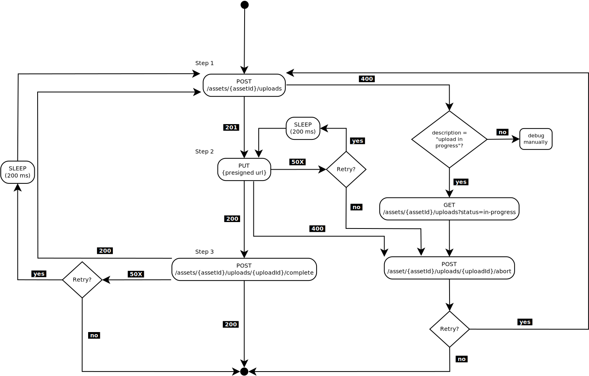

# STAC Asset Upload Error Handling

## Glossary

- Abort Upload: abort an upload in progress by sending and abort request to the service
- Cancel Upload: cancel the upload iteration without sending an abort request to the service

## Recurrent upload

If you have recurrent Asset uploads, you need to have a proper error handling otherwise the uploads might get stuck. Asset uploads operation are not stateless but statefull therefore the error handling is important. Here below is a simple practical example on which errors to handle in case of recurrent asset upload.

Note this example is only recommended if the upload is recurrent (for example every hour). The number of retries below depends on the upload frequency, if the upload frequency is daily then you might want to have at least 3 retries with some exponential backoff time between each retries, in opposite if the upload is done at high frequency you might skip the retries and simply cancel the upload, using the next upload iteration as retry.

1. Create Asset Upload

    ```text
    POST https://data.geo.admin.ch/api/stac/v0.9/collections/{collection}/items/{item}/assets/{asset}/uploads
    ```

    - `201 OK` => Continue to step 2.
    - `400 Bad Request`
        - Response is `{"description": "Upload already in progress", "code": 400}` => Abort the upload
            - To do so first get the `upload_id` of the `in-progress` upload via

                ```text
                GET https://data.geo.admin.ch/api/stac/v0.9/collections/{collection}/items/{item}/assets/{asset}/uploads?status=in-progress
                ```

            - Then using this id abort the upload

                ```text
                POST https://data.geo.admin.ch/api/stac/v0.9/collections/{collection}/items/{item}/assets/{asset}/uploads/{upload_id}/abort
                ```

            - Then restart the step 1.
        - Another `400 Bad Request` => Cancel upload

          Your request is not correct, analyze your request and correct it before retrying the step 1.

    - `500 Internal Server Error` => Cancel upload

        This is generally an application crash and should be notify to the service administrator, a retry would usually be useless, simply cancel the upload.
    - `502 Bad Gateway`, `503 Service Unavailable`, `504 Gateway Timeout` => Retry

        Service is momentarily not available, wait a short amount of time and retry step 1. the amount of time to wait and the number of retries depends on the upload rate, but a minimum wait time of 100ms is recommended.
2. Upload the parts via the presigned URL

    ```text
    PUT {presigned_url}
    ```

    - `200 OK` => Continue to step 3.
    - `400 Bad Request` => Abort upload

        Abort upload using the current `upload_id` and contact service administrator.

        ```text
        POST https://data.geo.admin.ch/api/stac/v0.9/collections/{collection}/items/{item}/assets/{asset}/uploads/{upload_id}/abort
        ```

    - `502 Bad Gateway`, `503 Service Unavailable`, `504 Gateway Timeout` => Retry

        Retry step 2. with a short wait time (min 100ms).

3. Complete the upload

    ```text
    POST https://data.geo.admin.ch/api/stac/v0.9/collections/{collection}/items/{item}/assets/{asset}/uploads/{upload_id}/complete
    ```

    - `200 OK` => Upload successful
    - `400 Bad Request` => Cancel upload

        Your request is invalid/incorrect, you need to cancel the upload script and verify its correctness.
    - `500 Internal Server Error` => Cancel upload

        This is generally an application crash and should be notify to the service administrator, a retry would usually be useless, simply cancel the upload.
    - `502 Bad Gateway`, `503 Service Unavailable`, `504 Gateway Timeout` => Retry

        Service is momentarily not available, wait a short moment (100ms), then retry the request.


The following figure shows the flow of a multipart upload process (raw version of this figure can be found [here](./assets/service-stac-upload-process.dia). You need [Dia](http://live.gnome.org/Dia) to edit the figure.)

